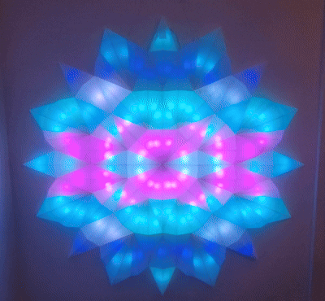
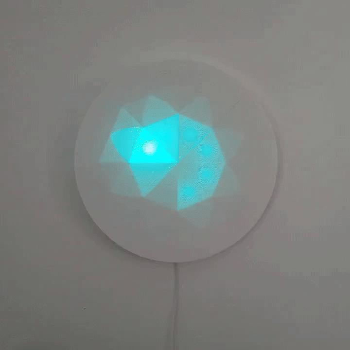
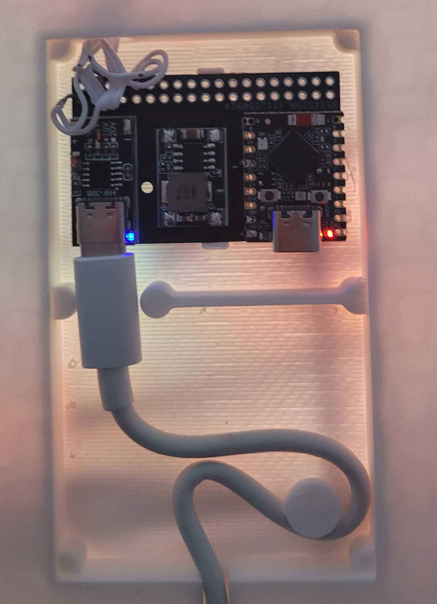

# SmartLED

Custom LED lighting projects powered by BareMetal [WLED](https://kno.wled.ge/) and controlled with the [Kolori mobile app](https://kolori.wasmer.app/).

## Projects

|                                  Starlight                                   |                            Starlite                             |                         Controller                          |
| :--------------------------------------------------------------------------: | :-------------------------------------------------------------: | :---------------------------------------------------------: |
|                    |        |  |
| 90cm LED strip light with 128 WS2815 LEDs in an 8x8 matrix configuration | Compact "Cheesecake Light" with custom 3D-printed enclosure |           WLED-powered LED control and setup            |

## Features

|     Custom Effects     | Audio Reactive |     Boot Presets      |      Multi-Device       |  Offline & Free   |
| :--------------------: | :------------: | :-------------------: | :---------------------: | :---------------: |
| Create unique patterns | Sync to music  | Auto-load on power-up | Control multiple lights | No login required |

## Quick Start

|         Step          | Action                                                                                                                                     |
| :-------------------: | ------------------------------------------------------------------------------------------------------------------------------------------ |
|   **1. Flash WLED**   | Use [WLED web installer](https://install.wled.me/) • For Starlight: upload configs from `starlight/wled_backup/`                           |
| **2. Install Kolori** | Download: [Google Play](https://play.google.com/store/apps/details?id=com.mrkprdo.kolori) • [App Store](https://apps.apple.com/app/kolori) |
|    **3. Connect**     | **Starlight:** Connect to WiFi → Scan/add in Kolori **Starlite:** Join "starlite" WiFi (pwd: `starlite4321`) → Add IP `4.3.2.1`        |

## Resources

| Category          | Links                                                                                                                                                                              |
| ----------------- | ---------------------------------------------------------------------------------------------------------------------------------------------------------------------------------- |
| **3D Models**     | Starlight: `starlight/3d_model/` • Starlite: `starlite/3d_model/`                                                                                                                  |
| **Documentation** | [Kolori Guide](https://kolori.wasmer.app/kolori-user-guide.html) • [Starlite Quick Start](https://kolori.wasmer.app/starlite-quick-start.html) • [WLED Docs](https://kno.wled.ge/) |
| **Source Code**   | [Kolori GitHub](https://github.com/mrkprdo/kolori) • [WLED GitHub](https://github.com/Aircoookie/WLED)                                                                             |
